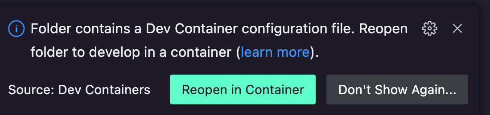
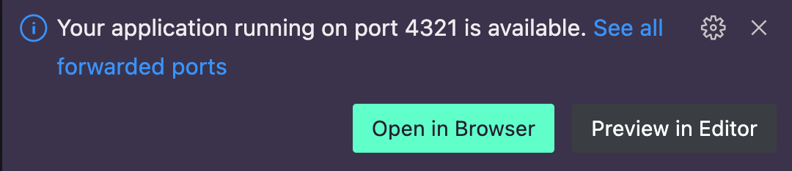

# EngineMakerのWebサイト

[](https://app.netlify.com/sites/emsite-draft/deploys)

## ローカル環境で動かす

```
bun i
bun dev
```

http://localhost:4321 を開く

## VSCodeのDev Containerで動かす

VSCodeでプロジェクトを開くと、右下に「Reopen in Container」というボタンが表示されるので、それをクリックしてください。  
表示されない場合は[Dev Containerの拡張](https://marketplace.visualstudio.com/items?itemName=ms-vscode-remote.remote-containers)をインストールしてください。  



Dev Containerで開いてしばらく待つと、ブラウザで[ローカル開発環境](http://localhost:4321)を開くボタンが表示されます。  


## ステージング環境

https://em-draft.mktoho.dev

mainブランチにpushすると自動でデプロイされます。

## Contribution

協力してくれる方は[Issue](https://github.com/EngineMaker/enginemaker-website/issues/new)を立てたりプルリクを送ったりしてくださいm(\_ \_)m
